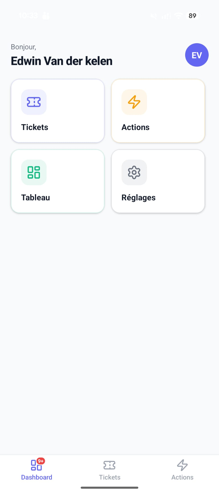
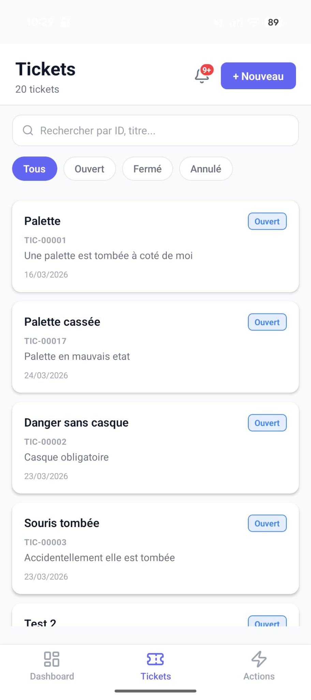

<p align="center">
  &nbsp;&nbsp;&nbsp;&nbsp;&nbsp;&nbsp;&nbsp;&nbsp;&nbsp;&nbsp;&nbsp;&nbsp;
  
</p>

# Projet C - Technical Documentation

**Version:** 4.0 — 01/04/2026  
**Status:** Clean Architecture + Stack Navigation + Actions + Search + Filters + RCA Investigation ✓

---

## Table of Contents

- [Context](#context)
- [Tech Stack](#tech-stack)
- [Project Architecture](#project-architecture)
- [SOLID Principles](#solid-principles-applied)
- [Navigation](#navigation)
- [Keycloak Authentication](#keycloak-authentication-oauth2-pkce)
- [BaseService](#baseservice--abstract-class)
- [Photo Upload](#photo-upload)
- [Environment Variables](#environment-variables)
- [Next Steps](#next-steps)
- [Changelog](#changelog)

---

## Context

Mobile port of the C web SaaS (React + Node.js) to a React Native + Expo application. Covers:

- Full Keycloak authentication with OAuth2 PKCE
- Clean Architecture with SOLID patterns
- Stack navigation per module
- Ticket screens (list, tabbed detail, creation)
- Full Actions module (list, detail, creation, closure/cancellation)
- RCA module (Root Cause Analysis — 9M, decisions, root causes)

---

## Tech Stack

| Technology | Version |
|---|---|
| Expo SDK | 54 |
| React Native | 0.81.5 |
| React | 19.1.0 |
| TypeScript | 5.9 |
| expo-auth-session | 7.x |
| expo-secure-store | 15.x |
| expo-web-browser | 15.x |
| expo-image-picker | 16.x |
| expo-linear-gradient | 14.x |
| react-native-svg | 15.x |
| @react-navigation/native | 6.x |
| @react-navigation/bottom-tabs | 6.x |
| lucide-react-native | latest |

---

## Project Architecture

```
C/
├── App.tsx                              ← Entry point + routing by AuthState
├── app.json                             ← Expo config (scheme: "c")
├── .env                                 ← Env variables (do not commit)
├── .env.example                         ← Team template (fake URLs)
└── src/
    ├── constants/
    │   └── api.ts                       ← BASE_URL, API_ROUTES, Keycloak config
    ├── types/
    │   ├── auth.ts                      ← AuthUser, AuthState, Company, Group
    │   ├── categories.types.ts          ← Category, Subcategory
    │   ├── ticket.types.ts              ← Ticket, Comment, Attachment, LinkedAction…
    │   ├── action.types.ts              ← Action, ActionDetail, ActionStatus…
    │   └── rca.types.ts                 ← RCACause, RCAAnalysis, RCACategory, UpdateRCACauseInput…
    ├── services/
    │   ├── interfaces/
    │   │   ├── ITokenStorage.ts         ← Token storage contract
    │   │   ├── IAuthService.ts          ← Keycloak auth contract
    │   │   ├── IApiService.ts           ← HTTP client contract
    │   │   └── IActionService.ts        ← Actions service contract
    │   ├── abstracts/
    │   │   └── BaseService.ts           ← Abstract base class for business services
    │   ├── categories/
    │   │   └── CategoriesService.ts     ← extends BaseService
    │   ├── ticket/
    │   │   └── TicketService.ts         ← extends BaseService
    │   ├── action/
    │   │   └── ActionService.ts         ← extends BaseService
    │   ├── rca/
    │   │   └── RCAService.ts            ← extends BaseService
    │   ├── members/
    │   │   └── MembersService.ts        ← extends BaseService
    │   ├── utils/
    │   │   ├── buildFormData.ts         ← appendIfPresent, appendFiles, appendArrayIfPresent
    │   │   ├── normalizeAttachments.ts  ← RawAttachment → Attachment
    │   │   └── errorMessage.ts          ← getErrorMessage(e: unknown): string
    │   ├── sessionEvents.ts             ← EventBus 401 → logout without circular dependency
    │   ├── tokenStorage.ts              ← ITokenStorage impl. (SecureStore)
    │   ├── authService.ts               ← IAuthService impl. (PKCE + revocation + refresh)
    │   └── apiService.ts                ← IApiService impl. (fetch + Bearer + 30s timeout)
    ├── context/
    │   └── AuthContext.tsx              ← React orchestration (thin layer)
    ├── hooks/
    │   ├── useApiCall.ts                ← { run, data, loading, error } generic hook
    │   ├── useCompanyId.ts              ← Reads companyId from AuthContext
    │   ├── useWorkspaceId.ts            ← Reads workspaceId from AuthContext
    │   ├── useCategories.ts             ← Categories hook
    │   ├── useTickets.ts                ← Ticket list hook
    │   ├── useTicket.ts                 ← Ticket detail hook
    │   ├── useTicketFilters.ts          ← Search + filters hook for tickets
    │   ├── useTicketMembers.ts          ← Ticket team hook (initiator, leader, collabs)
    │   ├── useCreateTicket.ts           ← Ticket creation + photo upload hook
    │   ├── useEntityComments.ts         ← Generic comments hook (ticket + action)
    │   ├── useComments.ts               ← Delegates to useEntityComments (ticket)
    │   ├── useActions.ts                ← Action list hook
    │   ├── useAction.ts                 ← Action detail hook
    │   ├── useActionFilters.ts          ← Search + filters hook for actions
    │   ├── useActionMembers.ts          ← Action team hook (initiator, leader, collabs)
    │   ├── useCreateAction.ts           ← Action creation hook
    │   ├── useActionComments.ts         ← Delegates to useEntityComments (action)
    │   ├── useActionStatus.ts           ← Status change + proof submission hook
    │   ├── useMembersAssignable.ts      ← Company members hook
    │   ├── useScheduledRefresh.ts       ← Deferred post-mutation timeouts with cleanup
    │   ├── useRCA.ts                    ← RCA loading + creation hook for a ticket
    │   ├── useRCACauses.ts              ← RCA causes CRUD hook (add, update, decide, delete)
    │   └── useTicketAttachments.ts      ← Ticket attachment upload hook
    ├── navigation/
    │   ├── AppNavigator.tsx             ← Bottom tabs: Dashboard + Tickets + Actions
    │   ├── TicketsNavigator.tsx         ← Stack: TicketsList → TicketDetail → CreateTicket
    │   └── ActionsNavigator.tsx         ← Stack: ActionsList → ActionDetail → CreateAction
    ├── screens/
    │   ├── LoginScreen.tsx              ← Login UI (gradient + mascot + animation)
    │   ├── DashboardScreen.tsx          ← Tile grid: Tickets, Actions, Settings
    │   ├── SettingsScreen.tsx           ← User profile + logout
    │   ├── TicketsScreen.tsx            ← Ticket list + search + filters
    │   ├── TicketDetailScreen.tsx       ← Ticket detail — 4 tabs
    │   ├── CreateTicketScreen.tsx       ← 2-step form + camera/gallery
    │   ├── ActionsScreen.tsx            ← Action list + search + filters
    │   ├── ActionDetailScreen.tsx       ← Action detail + closure + cancellation
    │   └── CreateActionScreen.tsx       ← Action creation form (Task)
    └── components/
        ├── shared/
        │   ├── ScreenHeader.tsx         ← Reusable header with back button
        │   ├── ImageViewer.tsx          ← Fullscreen viewer (Modal)
        │   ├── AttachmentsSection.tsx   ← Attachments grid
        │   ├── CommentsSection.tsx      ← Comments list + input field
        │   ├── PhotoUploadManager.tsx   ← Camera + gallery photo management
        │   └── DueDatePicker.tsx        ← iOS/Android date picker
        ├── tickets/
        │   ├── tabs/
        │   │   ├── TicketInfoTab.tsx        ← Ticket information tab
        │   │   ├── TicketActionsTab.tsx     ← Linked actions tab
        │   │   ├── TicketAttachmentsTab.tsx ← Attachments + comments tab
        │   │   └── InvestigationTab.tsx     ← RCA tab (9M, decisions, root causes)
        │   ├── TeamMembersSection.tsx   ← Team section (initiator, leader, collabs)
        │   ├── TicketInfoSection.tsx    ← Ticket info section
        │   ├── CategoryStep.tsx         ← Creation step 1: category selection
        │   ├── TicketFormStep.tsx       ← Creation step 2: form
        │   ├── LinkedActionsSection.tsx ← Linked actions list
        │   └── CreateQuickfixModal.tsx  ← Quickfix creation modal from a ticket
        └── actions/
            ├── ActionTitleBadges.tsx    ← Title + type/status badges
            ├── ActionInfoSection.tsx    ← Leader, dates, category info
            ├── SubtasksSection.tsx      ← Subtasks list
            ├── ProofSection.tsx         ← Execution proof display
            └── CloseActionSection.tsx   ← Closure / cancellation section
```

---

## SOLID Principles Applied

### Architecture Layers (strict order)

```
┌─────────────────────────────────────────────────────┐
│  SCREENS  (UI only, zero business logic)            │
└──────────────────┬──────────────────────────────────┘
                   │ useXxx()
┌──────────────────▼──────────────────────────────────┐
│  HOOKS  (React state, orchestration, filters)       │
└──────────────────┬──────────────────────────────────┘
                   │ new XxxService(token, companyId, workspaceId)
┌──────────────────▼──────────────────────────────────┐
│  SERVICES  (pure business logic, no React)          │
└──────────────────┬──────────────────────────────────┘
                   │ fetch() + AbortController
┌──────────────────▼──────────────────────────────────┐
│  INFRASTRUCTURE (SecureStore / Keycloak / API)      │
└─────────────────────────────────────────────────────┘
```

**Golden Rule:** A screen never talks directly to a service or fetch(). A hook never contains JSX. A service never imports React.

### S — Single Responsibility

Each file has a single responsibility:
- Screen = display
- Hook = state + logic
- Service = HTTP calls
- Component = reusable rendering

### O — Open/Closed

Adding a domain = creating a class that extends `BaseService`. Never modify `BaseService` for a specific case.

### L — Liskov Substitution

Any service can replace `BaseService` without breaking expected behavior.

### I — Interface Segregation

Hooks only expose what the screen needs. Implementation details (SecureStore, fetch, Keycloak) are invisible to consumers.

### D — Dependency Inversion

Screens depend on hooks (abstractions), never on concrete services. `AuthContext` depends on `IAuthService`, `ITokenStorage` interfaces — not implementations.

---

## Navigation

`App.tsx` routes by authentication state:

```typescript
status === 'loading'         → ActivityIndicator (SplashScreen)
status === 'idle' | 'error'  → LoginScreen
status === 'authenticated'   → AppNavigator (bottom tabs)
```

`AppNavigator` contains three tabs: Dashboard, Tickets, Actions. `RootTabParamList` is exported from `AppNavigator.tsx` to type `useNavigation` in screens.

---

## Keycloak Authentication (OAuth2 PKCE)

### Login Flow

```
[Login button]
    ↓
[expo-auth-session → Chrome Custom Tab / SFSafariViewController]
    ↓
[User enters credentials on Keycloak]
    ↓
[Keycloak redirects to c:// with ?code=...]
    ↓
[AuthService.exchangeCode() → access_token + refresh_token + id_token]
    ↓
[TokenStorage → encrypted SecureStore (Android Keystore / iOS Keychain)]
    ↓
[AppNavigator → tabs Dashboard / Tickets / Actions]
```

### Session Restore on Startup

On startup, `AuthContext` attempts to restore the session:

1. Reads `accessToken` from `SecureStore`
2. Calls `GET /api/v1/auth/me` to validate the token
3. If 401 → attempts `AuthService.refreshTokens()` with the refresh token
4. If refresh fails → `clearAll()` → LoginScreen

### 401 Handling During Use — SessionEventBus

`BaseService` cannot import `AuthContext` (circular dependency). Solution: `sessionEvents.ts` — singleton event bus.

```typescript
// BaseService — emits on each 401
if (res.status === 401) sessionEvents.emitSessionExpired();

// AuthContext — listens + attempts refresh before logout
sessionEvents.onSessionExpired(async () => {
  if (isRefreshingRef.current) return; // anti-duplicate lock
  isRefreshingRef.current = true;
  try {
    await AuthService.refreshTokens(refreshToken);
    // token renewed → user stays logged in
  } catch {
    await TokenStorage.clearAll();
    setState({ status: 'idle' });
  } finally {
    isRefreshingRef.current = false;
  }
});
```

The `isRefreshingRef` lock prevents multiple parallel refreshes if several requests receive 401 simultaneously.

### Logout Flow

```
[AuthService.revokeRefreshToken()]
    ↓
[WebBrowser → /openid-connect/logout?id_token_hint=...&post_logout_redirect_uri=c...://]
    ↓
[Keycloak destroys the SSO session]
    ↓
[TokenStorage.clearAll() → React state → idle → LoginScreen]
```

> **Note:** `id_token_hint` is mandatory — Keycloak 18+ returns HTTP 500 without this parameter.

### Tokens Stored in SecureStore

| Key | Content | Usage |
|---|---|---|
| `kc_access_token` | Bearer token API | Authenticated HTTP requests |
| `kc_refresh_token` | Refresh token | Revocation on logout + refresh |
| `kc_id_token` | OIDC ID token | id_token_hint for SSO logout |

### Security

| Mechanism | Detail |
|---|---|
| PKCE S256 | Binds the authorization code to the mobile app — RFC 8252 |
| Public client | No secret in the APK/IPA bundle |
| SecureStore | Android Keystore / iOS Keychain — hardware encryption |
| SessionEventBus | 401 → refresh/logout without circular dependency |
| Masked HTTP errors | In production, only the HTTP code is exposed (HTTP_404) |
| Upload validation | MIME type, size (max 10 MB) and count (max 5) verified before sending |

---

## BaseService — Abstract Class

Base class for all business services. Never use `fetch()` directly in a hook or screen.

```typescript
abstract class BaseService {
  constructor(
    protected readonly token: string,
    protected readonly companyId?: string,
    protected readonly workspaceId?: string
  ) {}

  protected get companyHeaders(): Record<string, string>
  protected get<T>(path, query?, headers?): Promise<T>
  protected post<T>(path, body?, headers?): Promise<T>
  protected put<T>(path, body?, headers?): Promise<T>
  protected patch<T>(path, body?, headers?): Promise<T>
  protected delete<T>(path, headers?): Promise<T>
  protected postFormData<T>(path, formData, headers?): Promise<T>
}
```

### What BaseService Handles Automatically

- Bearer token injected on every request
- `companyHeaders` generates `X-Company-Id` + `X-Workspace-Id` automatically
- 30s timeout via `AbortController` → `ApiError(408)`
- HTTP 401 → `sessionEvents.emitSessionExpired()`
- Empty response → returns `{} as T` without crashing
- Invalid JSON → `ApiError(200, 'Invalid response')`
- Server body masked in production (HTTP_xxx only)

### Creating a New Service

```typescript
export class WorkspaceService extends BaseService {
  constructor(token: string, companyId: string, workspaceId?: string) {
    super(token, companyId, workspaceId);
  }

  getWorkspaces(): Promise<Workspace[]> {
    return this.get<Workspace[]>('/api/v1/workspaces/', undefined, this.companyHeaders);
  }
}
```

### Instantiating in a Hook (never in a screen)

```typescript
const mutation = useCallback(async () => {
  const service = new WorkspaceService(accessToken!, companyId!, workspaceId ?? undefined);
  return service.getWorkspaces();
}, [accessToken, companyId, workspaceId]); // ← workspaceId mandatory in deps
```

---

## Required Business Headers

From the official Swagger. Rule to follow on every call:

| Domain | X-Company-Id | X-Workspace-Id |
|---|---|---|
| Tickets (all endpoints) | Required | Required |
| Actions (all endpoints) | Required | Required |
| Categories | Required | Required |
| Workspaces (CRUD) | Required | Not required |
| /workspaces/{id}/members/assignable | Required | Not required (in URL) |
| Company members | Required | Not required |
| Auth, Users | Not required | Not required |

Always pass `this.companyHeaders` — never build headers manually in a service method.

**Critical useCallback rule:** `workspaceId` must appear in the dependency array of any `useCallback` that instantiates a service. Without this, if `workspaceId` arrives after mounting (auth hydration), the closure captures `null` and requests are sent without `X-Workspace-Id`.

---

## Photo Upload

`appendFiles()` in `buildFormData.ts` validates before any network call:

| Constraint | Value |
|---|---|
| Allowed types | image/jpeg, image/png, image/webp, image/heic |
| Max size per file | 10 MB |
| Max number of files | 5 |

```typescript
export interface PhotoFile {
  uri: string;
  name: string;
  type: string;
  size?: number; // in bytes — used for client-side validation
}
```

> **Azure Blob Storage note:** Attachment SAS URLs expire after 1 hour. This is a backend constraint — URLs must be regenerated on the API side.

**Attachment normalization:** The API returns different field names from the web frontend (`original_filename`, `mime_type`, `file_size`). Normalization happens in `TicketService.getTicketById()` via the internal `RawAttachment` interface.

---

## Environment Variables

Fill in your local `.env` file (never commit). Refer to `.env.example`.

| Variable | Description |
|---|---|
| EXPO_PUBLIC_API_BASE_URL | Backend API base URL |
| EXPO_PUBLIC_KEYCLOAK_URL | Keycloak server URL |
| EXPO_PUBLIC_KEYCLOAK_REALM | Keycloak realm |
| EXPO_PUBLIC_KEYCLOAK_CLIENT_ID | Public client ID (Public type, no secret) |

> The `EXPO_PUBLIC_` prefix is mandatory for client-side exposure in React Native.

---

## Handover Notes — Frontend Team

### Unimplemented Endpoints (present in Swagger)

| Method | Endpoint | Usage |
|---|---|---|
| GET | /api/v1/actions/{id}/comments | List action comments |
| DELETE | /api/v1/actions/{id} | Delete an action |
| DELETE | /api/v1/tickets/{id} | Delete a ticket |
| PATCH | /api/v1/actions/{id}/ticket/{ticket_id} | Link an action to another ticket |

### MembersService — Known Technical Debt

`MembersService` has no explicit constructor and builds its headers manually. It works because member endpoints only require `X-Company-Id` today. To refactor to respect the `BaseService` pattern:

```typescript
export class MembersService extends BaseService {
  constructor(token: string, companyId: string, workspaceId?: string) {
    super(token, companyId, workspaceId);
  }

  getWorkspaceAssignable(workspaceId: string): Promise<AssignableMember[]> {
    return this.get<AssignableMember[]>(
      API_ROUTES.workspaceMembersAssignable(workspaceId),
      undefined,
      this.companyHeaders
    );
  }
}
```

### RCA — Category Not Persisted by the Backend

The API does not store the `category` field (9M) on causes. It is kept locally in memory via `catMap` on reload, but lost when the app is closed. To be implemented on the backend side for full persistence.

---

## Next Steps

### High Priority

- **Session expiration:** Store `expiresAt` at login, force re-login on startup if expired. Files: `ITokenStorage`, `tokenStorage.ts`, `AuthContext.tsx`
- **Persisted RCA category:** Ask the backend to add the `category` (9M) field in the API response for causes — currently kept in local memory only
- **Assignee name:** `assigned_to` returns a UUID. Resolve via `GET /api/v1/users/{id}` in `TicketDetailScreen`
- **Expired Azure SAS URLs:** Backend endpoint to be created to refresh attachment URLs

### Short Term

- Centralized design system (`src/theme/` — colors, typography, spacing)
- Shared component extraction: `<Badge>`, `<Card>`, `<Button>`
- `MembersService` refactor (see Handover Notes)

### Medium Term

- Push notifications: requires backend support (`POST /api/v1/users/push-token` + Expo Push Service trigger)
- Accessibility: `accessibilityLabel` on all interactive elements

### Long Term

- Dark mode: all colors are hardcoded in StyleSheets — requires ThemeContext + refactor of ~25 files
- Offline-first: WatermelonDB or MMKV + sync queue

---

## Running the Project

```bash
npm install
npx expo start
# Scan the QR code with Expo Go (same Wi-Fi network)
```

| Command | Action |
|---|---|
| r | Reload |
| npx expo start --clear | Reload + clear Metro cache |
| npx expo-doctor | Dependency check |
| npx tsc --noEmit | TypeScript check |

---

## Changelog

### v4.0 — 01/04/2026

- Ticket list UI overhaul: cards with shadow and borderRadius aligned with Actions design
- Category badge in list: "Safety · Unsafe Act" displayed on each ticket card, resolved from `category_id` via `useCategories` in `useTicketFilters`
- Double badge: category (orange) + status (colored) side by side on each card

### v3.9 — 01/04/2026

- Full RCA module: Investigation tab — RCA creation, adding causes with 9M categories (Lucide icons), decisions (root_cause/rejected/five_why), automatic root causes section
- Fix API field `cause_id`: API returns `cause_id` instead of `id` — normalized in `RCAService.getCauses()` and `createCause()`
- Fix API fields `status`/`is_root`: API does not use `decision` but `status` + `is_root: boolean` — types and logic updated
- Fix 9M category: not returned by the API — kept locally in optimistic state, preserved
